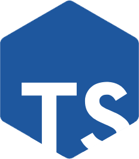

<!-- PROJECT SHIELDS -->
[![Forks][forks-shield]][forks-url]
[![Stargazers][stars-shield]][stars-url]
[![Issues][issues-shield]][issues-url]
[![LinkedIn][linkedin-shield]][linkedin-url]

<!-- PROJECT LOGO -->
<br />
<p align="center">
  <a href="https://github.com/tomimelo/basic-node-express-ts">
    
  </a>

  <h3 align="center">Basic Node Express Server</h3>

  <p align="center">
    This is a basic structure in typescript for a node express server project. It has error and exception handlers, loggers and database connector incorporated.
    <br />
    <a href="https://github.com/tomimelo/basic-node-express-ts"><strong>Explore the docs »</strong></a>
    <br />
    <br />
    <a href="https://github.com/tomimelo/basic-node-express-ts">View Demo</a>
    ·
    <a href="https://github.com/tomimelo/basic-node-express-ts/issues">Report Bug</a>
    ·
    <a href="https://github.com/tomimelo/basic-node-express-ts/issues">Request Feature</a>
  </p>
</p>


<!-- TABLE OF CONTENTS -->
<details open="open">
  <summary><h2 style="display: inline-block">Table of Contents</h2></summary>
  <ol>
    <li>
      <a href="#about-the-project">About The Project</a>
      <ul>
        <li><a href="#built-with">Built With</a></li>
      </ul>
    </li>
    <li>
      <a href="#getting-started">Getting Started</a>
      <ul>
        <li><a href="#prerequisites">Prerequisites</a></li>
        <li><a href="#installation">Installation</a></li>
        <li><a href="#build">Build</a></li>
        <li><a href="#development-server">Development server</a></li>
        <ul>
          <li><a href="#watch-file-changes">Watch file changes</a></li>
        </ul>
      </ul>
    </li>
    <li><a href="#usage">Usage</a></li>
    <li><a href="#contact">Contact</a></li>
    <li><a href="#acknowledgements">Acknowledgements</a></li>
  </ol>
</details>


<!-- ABOUT THE PROJECT -->
## About The Project

![product-screenshot]

### Built With

* [Node.js](https://nodejs.org/)
* [Express](https://expressjs.com/)
* [Typescript](https://www.typescriptlang.org/)


<!-- GETTING STARTED -->
## Getting Started

To get a local copy up and running follow these simple steps.

### Prerequisites

You will need a copy of [Node.js](https://nodejs.org/es/) as an environment to run the project. Then you need to use a dependency manager like npm to download dependencies into your project.

* npm
  ```sh
  npm install npm@latest -g
  ```

* Typescript
  ```sh
  npm install -g typescript
  ```

### Installation

1. Clone the repo
   ```sh
   git clone https://github.com/tomimelo/basic-node-express-ts.git
   ```
2. Install NPM packages
   ```sh
   npm install
   ```

### Compilation

Run `tsc` to compile the project. The compiled files will be stored in the `dist/` directory.

### Development server

Run `npm start` to compile and run the server. Server will be running by default in `http://localhost:3000/`.

### Watch file changes

To watch for file changes and restart server automatically is recommended to install [nodemon](https://github.com/remy/nodemon). You can install it globally by running `npm install -g nodemon`.
<br>
Open a terminal and run `tsc -w` to recompile automatically on file changes. On another terminal run `nodemon .` to rerun server on file changes.

<!-- USAGE EXAMPLES -->
## Usage

Folder structure
Helpers functions
Valid error codes
Error handler


<!-- CONTACT -->
## Contact

Tomás Melone - email

Project Link: [https://github.com/tomimelo/basic-node-express-ts](https://github.com/tomimelo/basic-node-express-ts)

<!-- ACKNOWLEDGEMENTS -->
## Acknowledgements

* [Node.js](https://nodejs.org/)
* [Typescript](https://www.typescriptlang.org/)
* [Express](https://expressjs.com/)
* [Config](https://github.com/lorenwest/node-config)
* [Nodemon](https://github.com/remy/nodemon/)
* [README](https://github.com/othneildrew/Best-README-Template) template by @othneildrew


<!-- MARKDOWN LINKS & IMAGES -->
[forks-shield]: https://img.shields.io/github/forks/tomimelo/basic-node-express-ts.svg?style=for-the-badge
[forks-url]: https://github.com/tomimelo/basic-node-express-ts/network/members
[stars-shield]: https://img.shields.io/github/stars/tomimelo/basic-node-express-ts.svg?style=for-the-badge
[stars-url]: https://github.com/tomimelo/basic-node-express-ts/stargazers
[issues-shield]: https://img.shields.io/github/issues/tomimelo/basic-node-express-ts.svg?style=for-the-badge
[issues-url]: https://github.com/tomimelo/basic-node-express-ts/issues
[linkedin-shield]: https://img.shields.io/badge/-LinkedIn-black.svg?style=for-the-badge&logo=linkedin&colorB=555
[linkedin-url]: https://linkedin.com/in/tomasmelone
[product-screenshot]: images/screenshot.png